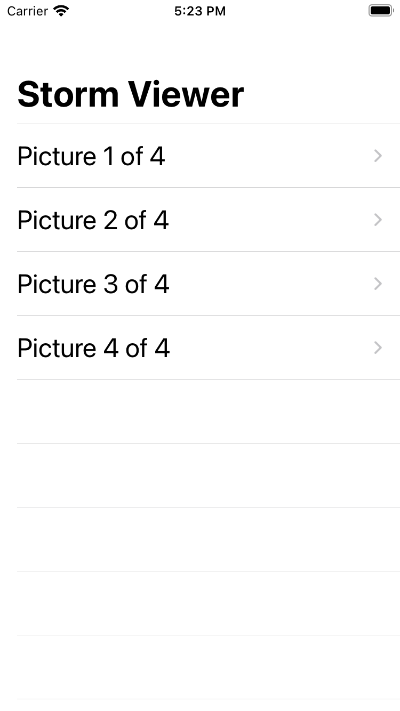

Simple Application Developed to Display Several Images in a List and Display them in the Full Screen Mode.
This project helps to understand the usage of view controllers, storyboards, and the FileManager class for beginers.
The Tutorial can be found here.  https://www.hackingwithswift.com/100/16

